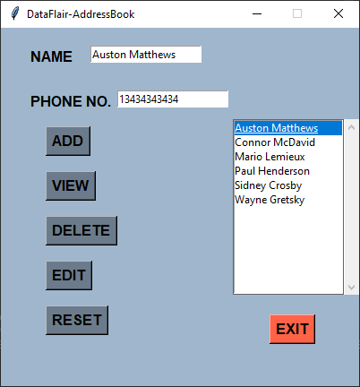

# Address Book in Python

A contact book or address book is an application that stores the information 
(name, address, contact no, etc.) of people that you save in it. You can 
also edit and delete the contact.

## About the project

The objective of this project is to create an Address book using python in 
which the user can add a new contact, edit and delete existing contact and 
view all the contact.

In this python project for beginners, the user has to click on a button 
which functions the user wants to access eg – To edit a contact, the user 
has to first select a contact then click on view button then edit the 
contact and then click on edit button. To add a new contact user has to 
click on the add button.

## Prerequisite

We build the address book project with the help of Tkinter module and basic 
python concept.

- Tkinter is a standard GUI library for rendering graphics

## Project Plan

These are the step to build a contact book python project:

- [x] Importing module
- [x] Initializing window
- [x] Define buttons
- [x] Define functions
- [x] Add unit tests
