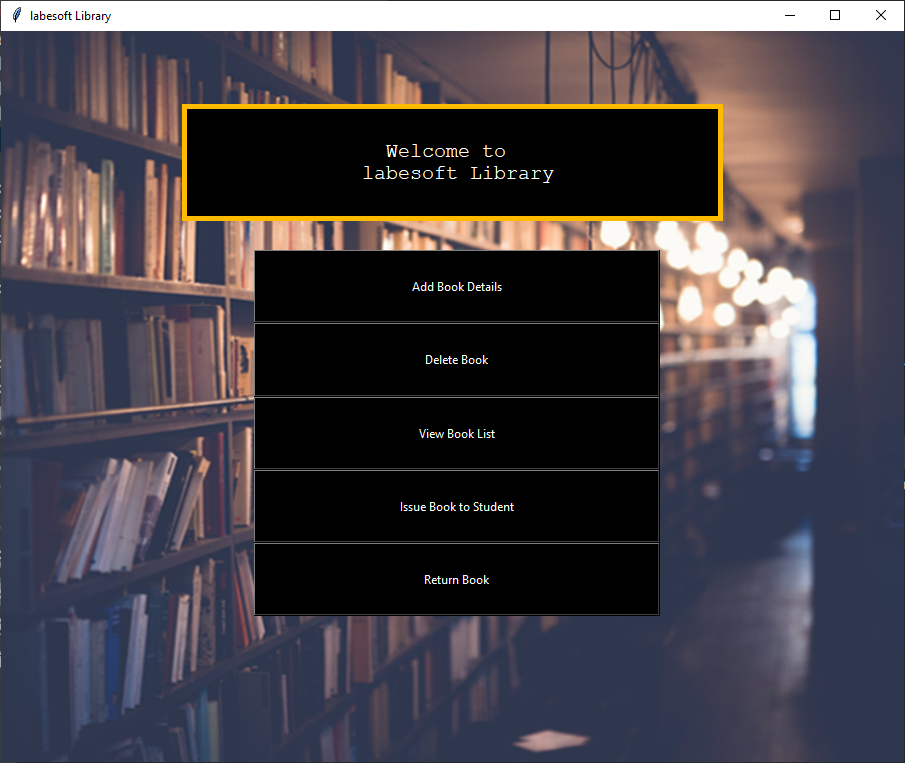

# [The Library Management System](https://data-flair.training/blogs/library-management-system-python-project/)

A library management system keeps track of the books present in the library. 
It is an important piece of software which is a must at schools and colleges.

## About the project

We will build a library management system using Tkinter to make it interactive.

## Prerequisite

Project Prerequisites

- tkinter
- pillow
- pymysql

## Project Plan

Below are the project steps:

- [ ] create the database
- [ ] main.py – which does function call to all other python files
- [ ] AddBook.py – To add the book
- [ ] ViewBooks.py – To View the list of books in the library
- [ ] DeleteBook.py – To Delete a book from library
- [ ] IssueBook.py – To Issue a book from library
- [ ] ReturnBook.py – To Return a book to the library
- [ ] Add unit tests
