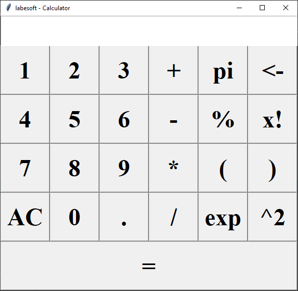

# A Python Simple Calculator

The calculator is one application that we all use in our day to day lives. 
If you are trying to get your hands dirty with programming in python, 

## About the project

Calculator is a project which is easy and useful at the same time. Today, we 
are going to build a Python Calculator using Tkinter with easy to understand 
steps.

## Prerequisite

Python offers various utilities to design the GUI wiz Graphical User 
Interface, and one such utility is Tkinter which is most commonly used.

## Project Plan

- [X] Importing the necessary modules
- [X] Making a window for our calculator
- [X] Designing the buttons
- [X] Mapping the buttons to their functionalities
