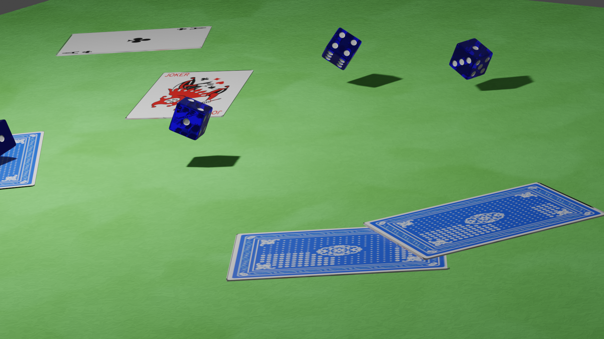
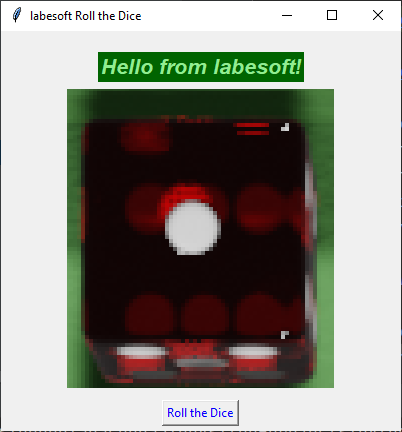

# Dice Rolling Simulator

[See the dice drop video here](archives/assets/game_intro.mp4)

Snake and Ladders, Ludo and Checkers, are the most favorite games of all time. 
But, it feels terrible when you drop the plan of playing just because you
couldn’t find the dice. So, here is a fascinating option to give you a chance
to make something cool. Let’s build a Dice Rolling Simulator with basic
knowledge of Python.

## About the project

We all know about dice. It’s a simple cube with numbers from 1 to 6 written 
on its face. But what is simulation? It is making a computer model. Thus, a 
dice simulator is a simple computer model that can roll a dice for us.

We now aim to build a dice simulator.

## Prerequisite

Python offers various packages to design the GUI, i.e. the Graphical User 
Interface. Tkinter is the most common, fast, and easy to use Python package 
used to build Graphical User Interface applications. It provides a powerful 
Object-Oriented Interface and is easy to use. Also, you develop an 
application; you can use it on any platform, which reduces the need of 
amendments required to use an app on Windows, Mac, or Linux.

## Project Plan

The project will develop as followed:

- [x] Importing the required modules: Tkinter, Image, ImageTk, Random
- [x] Building a top-level widget to make the main window for our 
  application (tk)
- [x] Designing the buttons
- [x] Forming a list of images to be randomly displayed
- [x] Constructing a label for image, adding a button and assigning 
  functionality
- [x] Launching the main loop
- [x] Write unit test for every function/class/method
