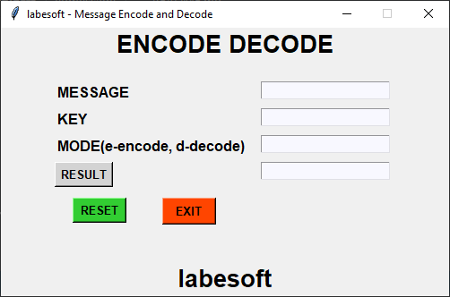

# Message Encode Decode in Python

Encoding is the process that transforms the text or information to the 
unrecognizable form and decryption is the process to convert the encrypted 
message into original form.

Message encoding and decoding is the process to first convert the original 
text to the random and meaningless text called ciphertext. This process is 
called encoding. Decoding is the process to convert that ciphertext to the 
original text. This process is also called the Encryption-Decryption process.

## About the project

The objective of this project is to encode and decode messages using a 
common key. This project will be built using the Tkinter and base64 library.

In this project, users have to enter the message to encode or decode. Users 
have to select the mode to choose the encoding and decoding process. The 
same key must be used to process the encoding and decoding for the same message.

## Prerequisite

To build this project we will use basic concept of python, Tkinter, and 
base64 library.

- Tkinter is a standard GUI python library
- base64 module provides a function to encode the binary data to ASCII 
  characters and decode that ASCII characters back to binary data.
  
## Project Plan

These are the step to build message encode – decode python project

- [X] Import module
- [X] Create display window
- [X] Define function
- [X] Define labels and buttons
