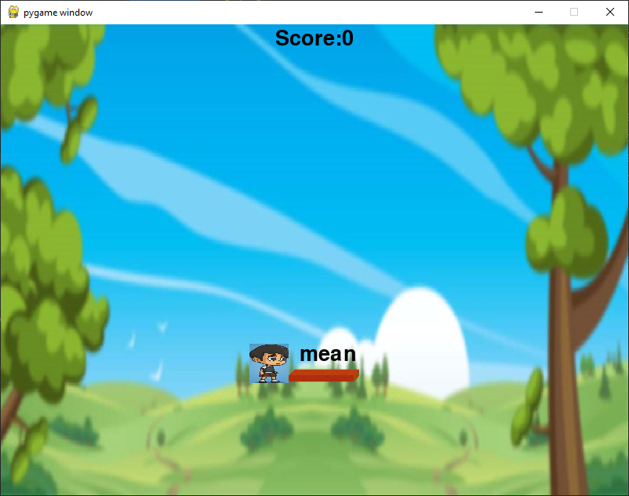

# [The Keyboard Jump Game](https://data-flair.training/blogs/keyboard-jump-game-in-python/)

Keyboard jump game is a speed typing game that helps in improving the typing 
speed of players.

## About the project

The object of Keyboard Jump Game Python Project is to build a keyboard jump 
game that helps players to increase their typing speed. We use pygame, 
random, and time modules in this project.

In this project, the player has to press the same keys to the letters 
displayed on the game screen. If the player made an error while typing then 
the game gets over.

## Prerequisite

To build a keyboard jump game project we require pygame, random and time 
modules, and basic concepts of python.

- Pygame module is used to make multimedia application and games
- Random modules used to generate random numbers
- Time module provides functionality like waiting during execution and also 
   measures the efficiency of code.

## Project Plan

To build this game here are the steps:

- [ ] Importing modules
- [ ] Initialize window
- [ ] Define functions
- [ ] Main loop
- [ ] Add unit tests
