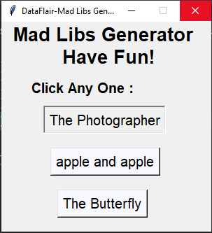
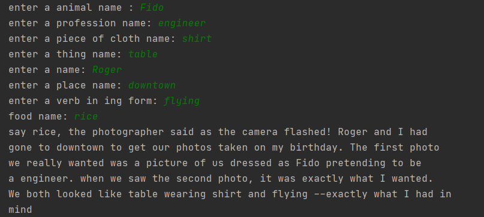

# [Python Mad Libs Generator Game](https://data-flair.training/blogs/python-mad-libs-generator-game/)

Mad libs generator is a fun game that is usually played by kids.

In this python game user has to enter substitutes for blanks in the story
without knowing the story. It will be fun to read aloud the stories after
filling the blanks.

## About the project

The objective of this project is to develop a Mad Libs Generator python project.
In this project, the user first has to pick a story by the title of the story.
Then the user has to enter specific words like a noun, adverb, verb, food,
adjective, etc, according to the requirements. And then the story will be
generated.

## Prerequisite

This is a python project for absolute beginners and is developed using the basic
concept of python and tkinter.

## Project Plan Checklist

These are the required steps to build Mad Libs generator python project:

- [x] Import modules
- [x] Create a display window
- [x] Define functions
- [x] Create buttons

So that is basically what we will do in this Python project. Let's start.

