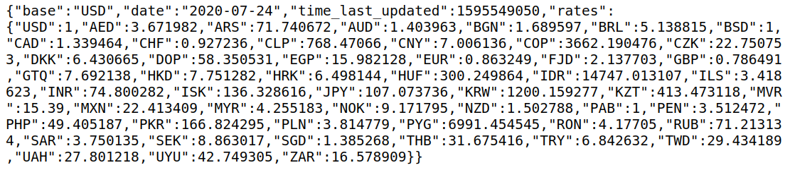

# [Money Changer: A currency converter](https://data-flair.training/blogs/currency-converter-python/)

We are going to build an exciting python project through 
which you can convert currencies. For a user interface, we are going to use 
the tkinter library.

## About the project

The objective of this project is to develop to convert currencies through a 
static mapping from a json file.

It will use a real-time exchange rates API at 
https://api.exchangerate-api.com/v4/latest/USD , for example:

Here, we can see the data in JSON format, with the following details:

Base – USD: It means we have our base currency USD. which means to convert 
any currency we have to first convert it to USD then from USD, we will 
convert it in whichever currency we want.

Date and time: It shows the last updated date and time.

Rates: It is the exchange rate of currencies with base currency USD.

## Prerequisite

The currency converter project in python requires you to have basic 
knowledge of python programming and the pygame library.

    tkinter – For User Interface (UI)
    requests – to get url

## Project Plan Checklist

Steps to Build the Python Project on Currency Converter

- [x] Real-time Exchange rates (docs)
- [x] Import required Libraries
- [x] CurrencyConverter Class
- [x] UI for CurrencyConverter
- [x] Main Function
- [ ] Unit test for the model
