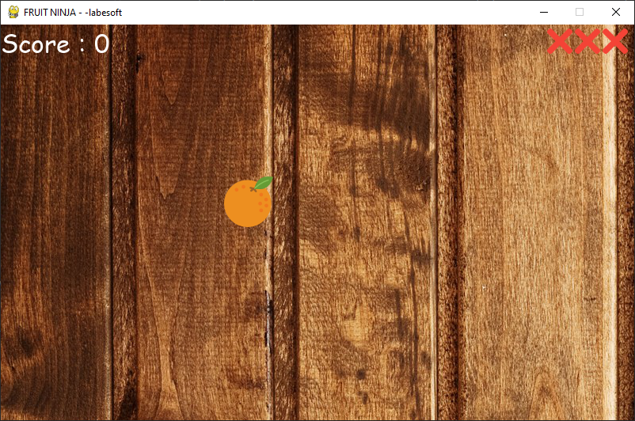

# The Ninja Fruit Game

Fruit ninja game, also known as fruit-slicing game which is easy to play. 
Fruit ninja game is popular among children.

## About the project

The objective of this project is to build a fruit ninja game with python. 
This game is built with the help of pygame module and basic concept of python.

In this game, the user has to cut the fruits by touching the mouse on fruits.
There are also bombs with fruits. If the mouse touches more than three bombs 
then the game will be over.

## Prerequisite

In this python project, we require:

- pygame
- random
- sys
- os

## Project Plan

These are the steps to build fruit ninja game :

- [X] Importing required modules
- [X] Initialize window
- [X] Define functions
- [X] Game loop
