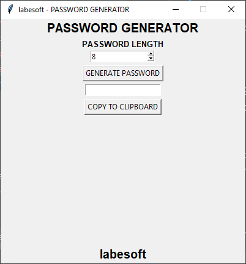

# [Password Generator](https://data-flair.training/blogs/python-password-generator/)

We know that passwords are a real security threat. To keep your account safe 
and prevent your password from being hacked you have to make your password 
hard enough that nobody can guess.

A Password Generator is a tool that generates passwords based on the given 
guidelines that you set to create an unpredictable strong password for your 
accounts.

The Password generator tool creates a random and customized password for 
users that helps them to create a strong password which provides greater 
security.

## About the project

The objective of this project is to create a password generator using python.
The password generator project will be build using python modules like 
Tkinter, random, string, pyperclip.

In this project, the user has to select the password length and then click 
on the “Generate Password” button. It will show the generated password below.
If the user clicks on the “Copy To Clipboard” button, then it will copy the 
password automatically.

## Prerequisite

To build this project we will use the basic concept of python and libraries 
- Tkinter, pyperclip, random, string.

    Tkinter is a standard GUI library and is one of the easiest ways to 
     build a GUI application.
    pyperclip module allows us to copy and paste text to and from the 
     clipboard to your computer
    The random module can generate random numbers
    string module contains a number of functions to process the standard 
     python string.

## Project Plan

The project will develop as followed:

- [x] Import modules
- [x] Initialized Window
- [x] Select Password Length
- [x] Define Functions
- [x] Write unit test for every function/class/method
- [x] Update readme with screenshot
