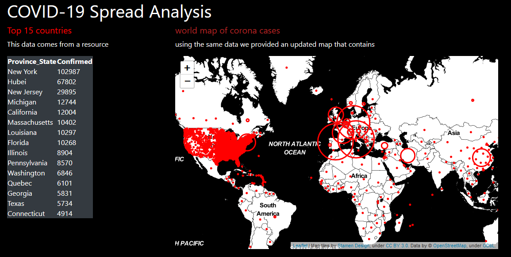

# Covid-19 Spread Analysis with Flask

In this python project, we will implement a live dashboard for COVID 19 
spread analysis. This dashboard will provide many insightful visualizations 
for the study of coronavirus spread.

## About the project

In this project, we will work on three different datasets and generate 
different dashboards.

## Prerequisite

We will be using flask and folium python packages for making interactive dashboards.

- Flask: It is a web server gateway interface application in python.
- Folium: It is a python API for visualizing data. 
- Covid Dataset: The dataset consists of corona spread data from different 
  countries and different cities.
  
## Project Plan

The project will be created by this order:

- [X] app.py
- [X] home.html
- [X] base.html
- [X] style.css
