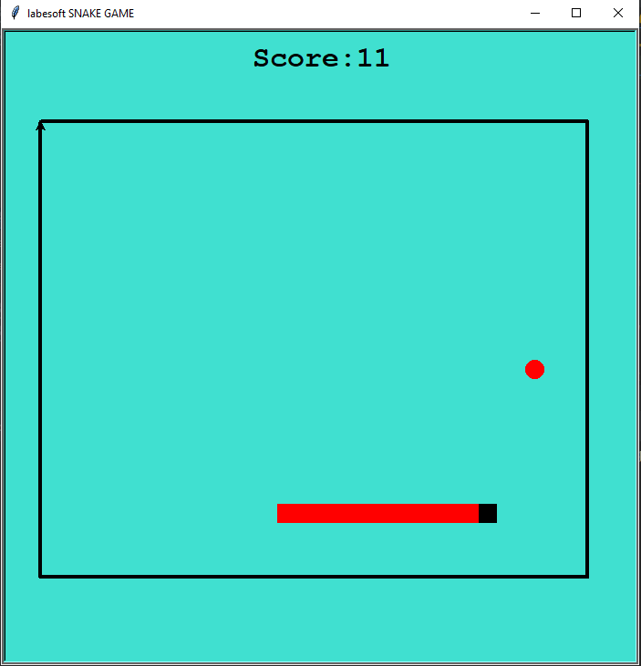

# [The Snaky Game in Python](https://data-flair.training/blogs/snake-game-python-program/)

The snake game is a very popular and fun game. Every time the snake eats the 
fruit, its length grows longer that makes the game more difficult.

## About the project

The objective of this python project is to build a snake game project. In 
this python project, the player has to move a snake so it touches the fruit. 
If the snake touches itself or the border of the game then the game will over.

## Prerequisite

To build the snake game project we used the turtle module, random module, 
time module, and concept of python.

- Turtle module gives us a feature to draw on a drawing board
- Random module will be used to generate random numbers
- Time module is an inbuilt module in python. It provides the functionality 
  of time.
  
## Project Plan

Steps to build a snake game project in python:

- [X] Importing libraries
- [X] Creating a game screen
- [X] Creating snake and food
- [X] Keyboard binding
- [X] Game mainloop
