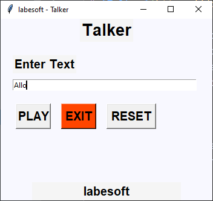

# [Talker](https://data-flair.training/blogs/python-text-to-speech/)

Text to speech is a process to convert any text into voice. Text to speech 
project takes words on digital devices and convert them into audio with a 
button click or finger touch. Text to speech python project is very helpful 
for people who are struggling with reading.

## About the project

The objective of this project is to convert the text into voice with the 
click of a button. This project will be developed using Tkinter, gTTs, and 
playsound library.

In this project, we add a message which we want to convert into voice and 
click on play button to play the voice of that text message.

## Prerequisite

To implement this project, we will use the basic concepts of Python, Tkinter, gTTS, and playsound libraries.

- Tkinter is a standard GUI Python library that is one of the fastest and 
    easiest ways to build GUI applications using Tkinter.
- gTTS (Google Text-to-Speech) is a Python library, which is a very easy 
    library that converts the text into audio.
- The playsound module is used to play audio files. With this module, we 
    can play a sound file with a single line of code.

## Project Plan Checklist

So these are the basic steps that we will do in this Python project:

- [x] Importing the modules
- [x] Create the display window
- [x] Define functions
- [x] Add unit tests
