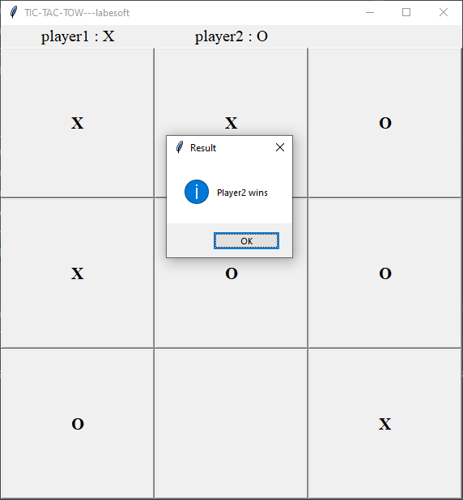

# [Classic Tic-Tac-Toe Game in Python](https://data-flair.training/blogs/python-tic-tac-toe/)

Tic-Tac-Toe game is an easy game which is mostly played among children and 
it also helps them to improve their concentration.

## About the project

The objective of this tic-tac-toe game python project is to build a 
tic-tac-toe game so you can play it without wasting paper and improve your 
concentration. To build this game we use the tkinter module with the concept 
of python.

To play this game we require two players to play one is X and the other is O 
and both players play by putting their marks in empty squares.

To win the game players have to get 3 of her marks in a row (up, down, 
across, or diagonally).

## Prerequisite

To build tic-tac-toe game using python we require tkinter module and basic 
concept of python

- Tkinter modules is a standard graphical user interface used to render 
  graphics.
- Tkinter.messagebox used to display message box

## Project Plan

These are the step to build Tic-Tac-Toe game using python :

- [X] Import modules
- [X] Initialize window
- [X] Function to check result
- [X] Function to check the winner
- [X] Define labels and buttons
